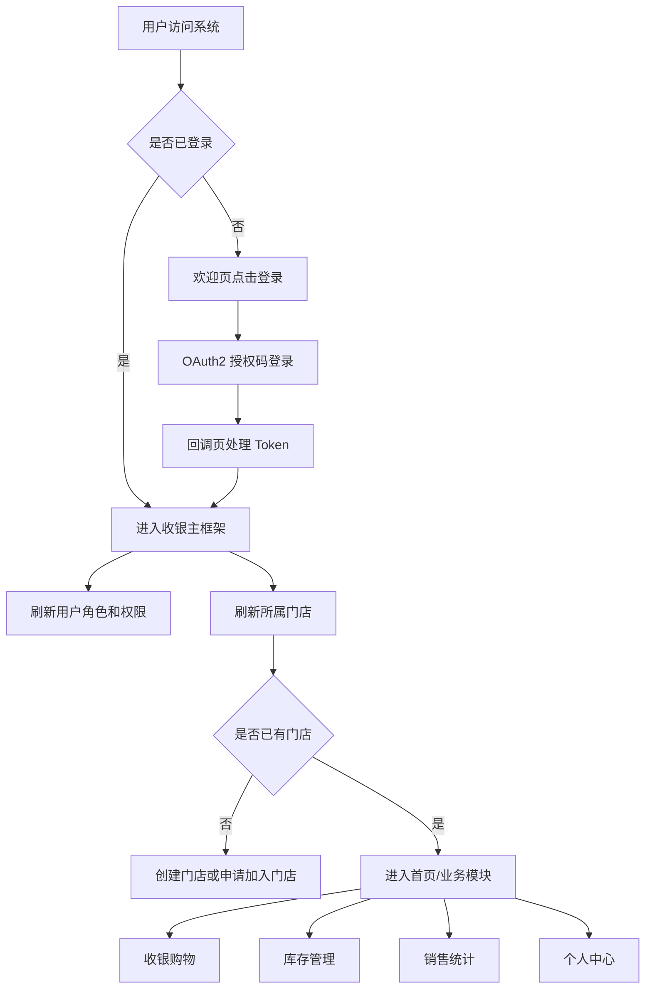
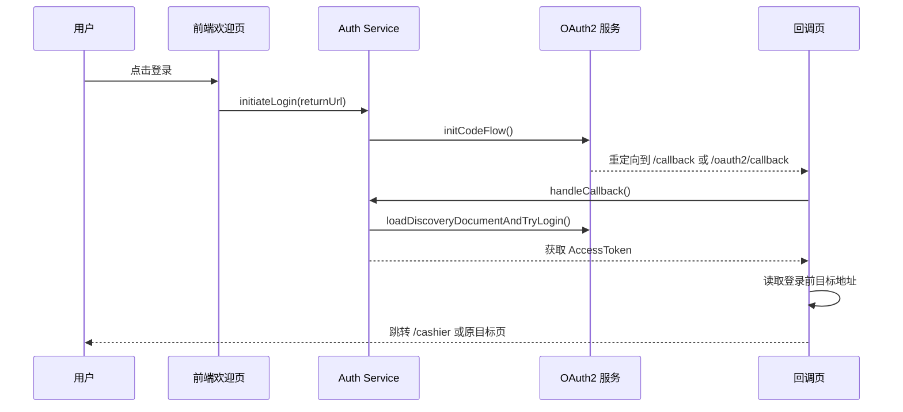
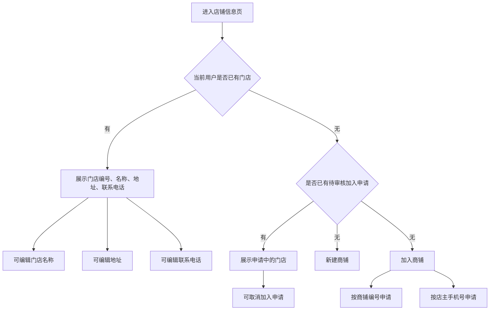
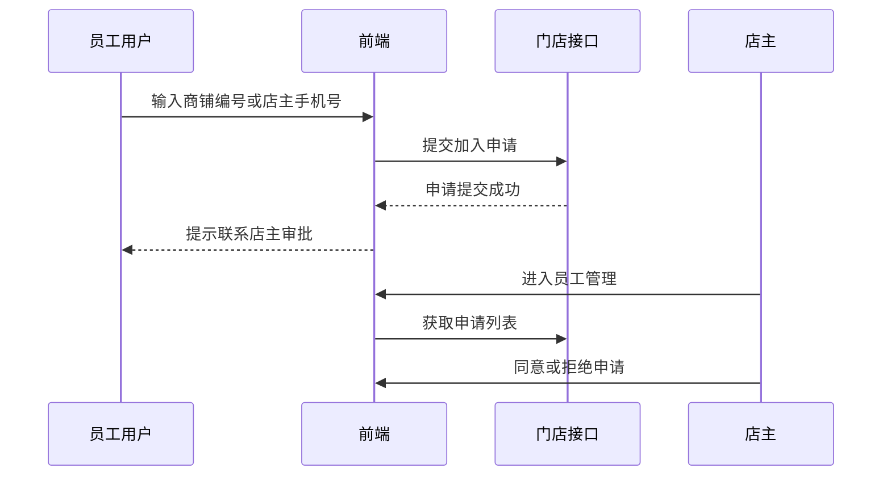
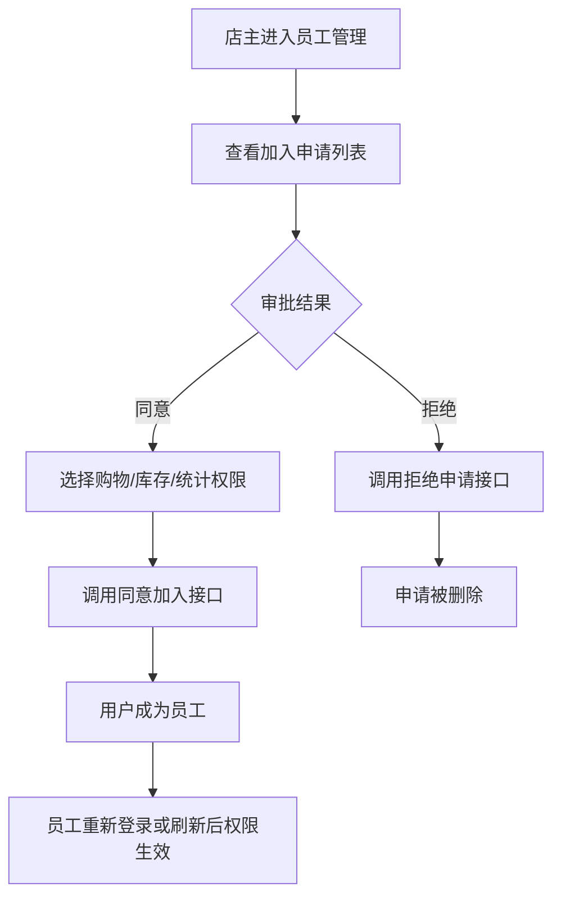
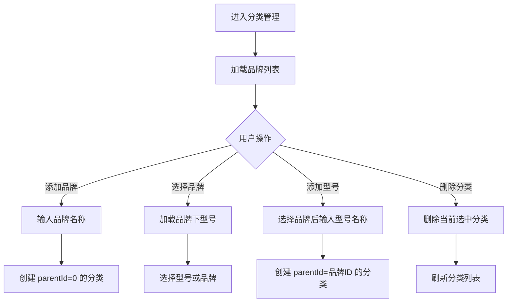
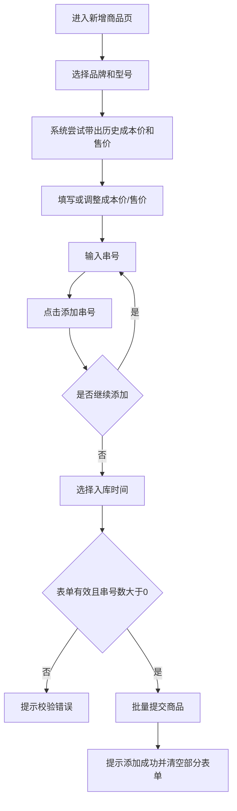
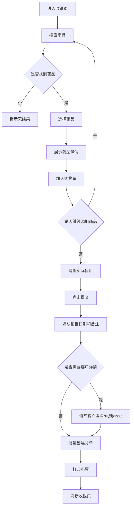
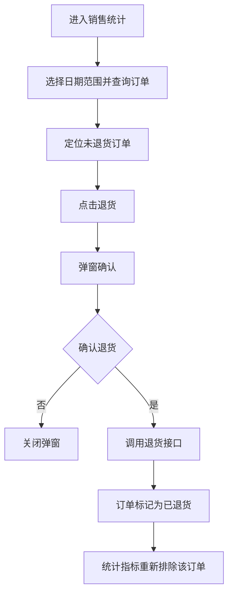

# 销售宝收银系统需求文档（反向整理）

> 依据当前前端实现、服务调用与仓库内 API 文档反向整理。本文用于后续重构时确认功能边界、角色权限、业务流程与接口依赖。

## 1. 项目概览

### 1.1 系统定位

本项目是一个面向门店的库存与收银管理前端，核心目标是支持门店完成：

- 商品分类与库存录入。
- 库存查询、修改、删除、盘点统计与导出。
- 商品销售、购物车结算、小票打印。
- 销售订单查询、销售统计、退货与补打小票。
- 门店创建、加入申请、员工审批与权限管理。
- 用户资料、门店资料维护。

### 1.2 技术栈

- 前端框架：Angular 20，Standalone Components。
- UI 组件：Angular Material。
- 认证：OAuth2 Authorization Code Flow，使用 `angular-oauth2-oidc`。
- 打印：`ngx-print`。
- Excel 导出：`xlsx`。
- 新手引导：`driver.js`。
- 日期处理：前端以 `Date` 作为 UI 状态，接口交换使用 ISO-8601 UTC 字符串。

### 1.3 入口与路由

| 路由 | 页面 | 权限 |
|---|---|---|
| `/welcome` | 欢迎页/登录入口 | 公开 |
| `/callback`、`/oauth2/callback` | OAuth 回调页 | 公开 |
| `/cashier` | 主框架 | 已登录 |
| `/cashier/home` | 首页公告 | 已登录 |
| `/cashier/shopping` | 收银购物 | 店主或 `PERMISSION:shopping` |
| `/cashier/inventory` | 库存管理 | 店主或 `PERMISSION:inventory` |
| `/cashier/statistics` | 销售统计 | 店主或 `PERMISSION:statistic` |
| `/cashier/center/profile` | 我的信息 | 已登录 |
| `/cashier/center/store` | 店铺信息 | 已登录 |
| `/cashier/center/staff` | 员工管理 | 当前页面可进入；核心接口要求店主 |
| `/cashier/center/member` | 会员管理 | 已登录；当前仅占位 |

## 2. 用户角色与权限

### 2.1 角色

| 角色 | 说明 |
|---|---|
| `ROLE_DEFAULT` | 默认用户，未创建或加入门店时常见。可发起加入门店申请。 |
| `ROLE_OWNER` | 店主。拥有购物、库存、统计功能访问权，并可管理员工和申请。 |
| `ROLE_STAFF` | 员工。根据店主分配的权限访问业务模块。 |

### 2.2 权限点

| 权限 | 对应模块 |
|---|---|
| `PERMISSION:shopping` | 收银购物 |
| `PERMISSION:inventory` | 库存管理 |
| `PERMISSION:statistic` | 销售统计 |

### 2.3 权限规则

- 主框架 `/cashier` 需要有效登录态。
- 购物、库存、统计分别由 `permissionGuard` 校验。
- 店主绕过模块权限检查，默认可访问所有业务模块。
- 非店主必须拥有对应权限；否则跳转到 `/cashier/center/store` 并提示权限不足。
- 权限校验失败或超时会提示权限验证失败，并跳转到店铺信息页。

## 3. 总体业务流程

## 4. 认证与会话

### 4.1 登录流程

### 4.2 接口拦截与 Token 刷新

- 所有相对 URL 请求自动加上 `environment.wmsApiUrl`。
- 有有效 AccessToken 时自动添加 `Authorization: Bearer <token>`。
- 401 时尝试静默刷新 Token，并重放原请求。
- 刷新失败后提示“验证信息失效，请重新登陆”，跳转欢迎页。
- 0 状态提示网络错误，500 提示服务器未响应，400 展示后端错误消息。

### 4.3 登出

- 清理登录后回跳地址。
- 清理本地 OAuth 状态。
- 跳转 `/welcome`。

## 5. 首页与主框架

### 5.1 主框架

功能点：

- 顶部栏显示系统名“销售宝”。
- 侧边导航进入收银、库存、数据、个人中心。
- 支持退出登录。
- 支持“开启新手导航”：清理本地引导标记并刷新页面。
- 店主进入主界面时读取待审批加入申请数量，并在个人中心入口显示提醒。
- 首次进入系统时展示新手引导，介绍收银、库存、数据等主功能。

### 5.2 首页公告

功能点：

- 展示当前日期。
- 获取并展示 `warn` 类型公告。
- 获取并展示 `update` 类型公告。
- 当公告内容为空或过短时显示默认“无”。

## 6. 门店与员工管理

### 6.1 门店状态流程

### 6.2 创建门店

表单字段：

| 字段 | 必填 | 校验 |
|---|---|---|
| 商铺名称 | 是 | 3-30 字符 |
| 地址 | 否 | 最长 200 字符 |
| 联系方式 | 否 | 最长 200 字符 |
| 创建时间 | 是 | 默认当前时间 |

流程：

1. 用户未加入门店时点击“新建商铺”。
2. 填写门店信息。
3. 调用创建门店接口。
4. 创建成功后提示成功，关闭弹窗并刷新门店缓存。

### 6.3 加入门店

方式：

- 按商铺编号申请加入。
- 按店主手机号申请加入，手机号需匹配中国大陆手机号格式 `^1[3-9]\d{9}$`。

流程：

### 6.4 员工审批

店主功能点：

- 查看已有员工列表：编号、名称、电话号码。
- 查看加入申请列表：编号、名称、电话号码。
- 同意加入申请，并同时分配购物、库存、统计权限。
- 拒绝加入申请。
- 修改员工权限。
- 将员工移出门店。
- 当前登录账号在员工列表中显示为“本账号”，不展示修改权限和删除操作。

审批权限默认值：

- 同意加入时购物、库存、统计三个权限默认勾选。

员工审批流程：

## 7. 个人中心

### 7.1 我的信息

功能点：

- 展示头像和昵称。
- 个人信息页支持修改昵称。
- 昵称不能为空，不能为“未设置”。
- 修改成功后刷新用户资料缓存。

当前未启用：

- 手机号展示被注释。
- 邮箱展示被注释。

### 7.2 会员管理

当前状态：

- 路由和菜单存在。
- 组件为空实现，尚无会员业务功能。

重构时建议：

- 明确该模块是保留占位、移除入口，还是补充会员档案、积分/储值、消费记录等功能。

## 8. 商品分类管理

### 8.1 分类结构

当前实现按树形分类处理：

- 根分类通常作为“品牌”。
- 子分类通常作为“型号”。
- 分类选择组件支持继续加载下级分类，库存筛选中存在三级选择能力。
- 分类管理与新增商品页主要使用品牌/型号两级。

### 8.2 分类选择

功能点：

- 加载根分类。
- 选择根分类后加载下级型号。
- 选择型号后可继续加载第二级子分类。
- 每次选择会向父组件输出当前选中分类。

### 8.3 分类管理

功能点：

- 添加品牌。
- 选中品牌后添加型号。
- 选择分类。
- 删除当前选中分类。
- 删除后重置分类选择并刷新根分类。

分类管理流程：

## 9. 库存管理

### 9.1 库存列表

功能点：

- 默认加载未售商品，当前前端一次请求 500 条。
- 表格字段：序号、型号、串号、成本价格、售价、录入时间、修改、删除。
- 本地分页，页大小选项为 10、20、50。
- 按分类筛选库存。
- 按型号名称或串号进行本地筛选。
- 显示当前筛选结果数量。
- 显示筛选结果总成本，可隐藏/显示。
- 显示筛选结果总售价。
- 支持导出当前筛选结果为 Excel。
- 支持盘库统计弹窗。

### 9.2 新增商品

表单字段：

| 字段 | 必填 | 校验 |
|---|---|---|
| 分类/型号 | 是 | 分类 ID 必须大于 0 |
| 成本价 | 是 | 1-999999 |
| 售价 | 是 | 1-999999 |
| 串号 | 是 | 至少添加 1 个串号 |
| 入库时间 | 是 | 默认当前日期 |

功能点：

- 通过分类管理组件选择型号。
- 选择型号后尝试读取该型号已有商品，并自动带出第一条商品的成本价和售价。
- 串号通过输入框和添加按钮加入集合。
- 串号集合天然去重。
- 可从集合中删除已添加串号。
- 提交时批量创建商品。
- 创建成功后清空成本、售价和串号集合。

新增商品流程：

### 9.3 修改商品

功能点：

- 从库存列表点击编辑。
- 弹窗编辑成本价、售价、串号。
- 成本价和售价校验范围为 1-999999。
- 串号必填。
- 修改成功后按原分类刷新列表。

### 9.4 删除商品

功能点：

- 从库存列表点击删除。
- 弹窗确认。
- 删除成功后按原分类刷新列表。

### 9.5 盘库统计

功能点：

- 请求后端按分类返回库存统计。
- 弹窗展示每个分类的总数、已售数量、总成本、总售价等。

### 9.6 库存导出

导出字段：

- 序号。
- 型号。
- 成本。
- 售价。
- 串号。
- 录入时间。

导出文件名格式：

- `库存情况_年_月_日.xlsx`。

## 10. 收银购物

### 10.1 商品搜索

功能点：

- 输入串号、型号或其他文本搜索未售商品。
- 搜索结果使用自动完成下拉展示。
- 搜索无结果时给搜索框设置空结果错误。
- 选择搜索结果后，将商品传给收银页。

### 10.2 购物车

功能点：

- 展示选中商品的型号、串号、标价。
- 点击“结账”加入购物车。
- 同一商品不可重复加入购物车。
- 购物车展示消费明细。
- 支持修改每个商品的实际销售价格。
- 支持从购物车移除单项。
- 支持清空购物车。
- 购物车为空时禁止提交。

### 10.3 订单确认

表单字段：

| 字段 | 必填 | 默认值 |
|---|---|---|
| 销售日期 | 是 | 当前日期 |
| 备注 | 否 | 空 |
| 客户姓名 | 否 | 空；仅开启客户详情时进入小票 |
| 客户电话 | 否 | 空；仅开启客户详情时进入小票 |
| 客户地址 | 否 | 空；仅开启客户详情时进入小票 |

功能点：

- 计算购物车总销售金额。
- 将购物车中的商品转换为订单列表。
- 对每个订单写入实际售价、销售时间、备注、未退货状态。
- 支持可选客户详情写入小票。
- 批量提交订单。
- 提交成功后提示成功、关闭弹窗、打印小票并刷新页面。
- 提交期间禁止重复提交。

收银流程：

### 10.4 小票打印

功能点：

- 小票包含订单商品、金额、合计金额、门店信息、操作人信息。
- 总金额支持中文大写金额显示。
- 订单确认成功后自动打印。
- 销售统计中可对未退货订单补打小票。
- 小票组件会根据商品分类父级查询上级分类名称，用于补充商品型号/品牌展示。

## 11. 销售统计与售后

### 11.1 订单查询

功能点：

- 默认查询当天 00:00:00 到 23:59:59 的订单。
- 支持按日期范围查询。
- 当前前端一次请求 500 条。
- 表格字段：单号、型号、串号、成本价格、实际售价、销售时间、备注、退货、补打。
- 本地分页，页大小选项为 10、20、50。
- 按型号名称或串号筛选。
- 可切换是否包含退货单。

### 11.2 销售指标

根据当前筛选结果计算：

- 当前数量。
- 总利润：未退货订单的实际售价减成本价。
- 总成本：未退货订单的商品成本之和。
- 销售额：未退货订单实际售价之和。

成本与利润可隐藏/显示。

### 11.3 退货

功能点：

- 未退货订单可点击退货。
- 弹窗确认后调用退货接口。
- 成功后将当前行标记为已退货。
- 已退货订单在列表中显示特殊样式。
- 已退货订单不参与利润、成本、销售额统计。
- 已退货订单不展示补打按钮。

退货流程：

### 11.4 补打小票

功能点：

- 未退货订单可补打小票。
- 点击补打后弹窗确认。
- 确认后调用小票打印。

### 11.5 销售导出

导出字段：

- 序号。
- 型号。
- 串号。
- 成本。
- 实际售价。
- 是否退货。
- 录入时间。
- 备注。

导出文件名格式：

- `销售情况_年_月_日.xlsx`。

## 12. 数据模型

### 12.1 用户资料 `UserProfile`

| 字段 | 类型 | 说明 |
|---|---|---|
| `userId` | number | 用户 ID |
| `nickname` | string | 昵称 |
| `email` | string | 邮箱 |
| `phoneNumber` | string | 手机号 |
| `avatar` | string | 头像地址 |

### 12.2 门店 `Group`

| 字段 | 类型 | 说明 |
|---|---|---|
| `id` | number | 门店 ID |
| `storeName` | string | 门店名称 |
| `address` | string | 门店地址 |
| `contact` | string | 联系方式 |
| `createTime` | Date | 创建时间 |

### 12.3 分类 `Category`

| 字段 | 类型 | 说明 |
|---|---|---|
| `id` | number | 分类 ID |
| `parentId` | number | 父分类 ID |
| `name` | string | 分类名称 |

### 12.4 商品 `Merchandise`

| 字段 | 类型 | 说明 |
|---|---|---|
| `id` | number | 商品 ID |
| `category` | Category | 商品分类 |
| `cost` | number | 成本价 |
| `price` | number | 标准售价 |
| `imei` | string | 商品串号 |
| `sold` | boolean | 是否已售 |
| `createTime` | Date | 入库时间 |

### 12.5 订单 `Order`

| 字段 | 类型 | 说明 |
|---|---|---|
| `id` | number | 订单 ID |
| `merchandise` | Merchandise | 关联商品 |
| `sellingPrice` | number | 实际售价 |
| `remark` | string | 备注 |
| `sellingTime` | Date | 销售时间 |
| `returned` | boolean | 是否已退货 |

### 12.6 盘库统计 `MeCount`

| 字段 | 类型 | 说明 |
|---|---|---|
| `cateName` | string | 分类名称 |
| `total` | number | 总数量 |
| `sold` | number | 已售数量 |
| `totalCost` | number | 总成本 |
| `totalPrice` | number | 总售价 |

## 13. 外部接口依赖

### 13.1 WMS Cashier API

| 模块 | 关键接口 |
|---|---|
| 分类 | `GET /category/parent/{parentId}`、`GET /category/{id}`、`POST /category/`、`DELETE /category/{id}` |
| 门店 | `GET /group/`、`POST /group/`、`PUT /group/storename`、`PUT /group/address`、`PUT /group/contact` |
| 员工与申请 | `GET /group/staffs`、`DELETE /group/staff`、`POST /group/join/id`、`POST /group/join/phone`、`GET /group/join/`、`DELETE /group/join/delete`、`GET /group/join/users`、`DELETE /group/join/delete/id`、`POST /group/join/agree`、`PUT /group/permissions`、`GET /group/permissions` |
| 商品 | `GET /merchandise`、`GET /merchandise/cate`、`POST /merchandise`、`PUT /merchandise/{id}`、`DELETE /merchandise/{id}`、`GET /merchandise/search`、`GET /merchandise/account` |
| 订单 | `POST /order/batch`、`GET /order/range`、`PUT /order/return/{id}` |
| 用户资料 | `GET /profile/role`、`GET /profile/permissions`、`PUT /profile/nickname` |
| 公告 | `GET /notice/` |

### 13.2 Auth Service

当前前端主要依赖 OAuth2/OIDC 能力：

- 授权码登录。
- OIDC Discovery。
- Token 获取与刷新。
- Token 登出/本地清理。

仓库内文档还包含账号注册、登录、资料、手机号/邮箱绑定、客户端管理等能力，但当前收银前端未直接实现对应页面。

## 14. 时间与金额规则

### 14.1 时间

- 后端接口要求使用 ISO-8601 UTC 字符串，并带 `Z` 后缀。
- 前端 UI 使用 `Date`。
- 请求前通过工具方法转换为 UTC 字符串。
- 展示时使用本地时区格式化；无法判断时区时按 UTC+8 展示。
- 销售统计选择结束日期时，会自动扩展到当天 23:59:59。

### 14.2 金额

- 商品成本价、售价、订单实际售价在前端使用 number。
- 后端可能返回 number 或 string，服务层统一 `Number(...)` 转换。
- 库存和统计中的成本、利润默认可隐藏，避免敏感数据直接暴露。

## 15. 新手引导

系统使用 `driver.js` 并按模块保存本地引导状态。

引导模块：

- `home`：主导航与首次使用建议。
- `shopping`：搜索商品、加入购物车、修改价格、提交。
- `inventory`：库存列表、分类筛选、搜索、导出。
- `create`：新增商品、选择型号、添加品牌/型号、录入串号、提交。

主框架支持清理引导状态并刷新页面。

## 16. 当前实现中的边界与重构关注点

### 16.1 已实现但需要重构时保持的行为

- OAuth2 登录后回跳登录前目标 URL。
- 401 静默刷新 Token 并重放请求。
- 店主自动拥有所有业务模块权限。
- 员工权限变更后需要刷新或重新登录才能生效。
- 商品搜索默认搜索未售商品。
- 购物车禁止重复添加同一商品。
- 批量下单成功后立即打印小票并刷新页面。
- 退货订单不再计入销售额、利润和成本。
- Excel 导出基于当前筛选后的数据。

### 16.2 当前功能缺口或风险

- 会员管理只有菜单和空组件，没有业务功能。
- 员工管理页面路由本身没有前端权限守卫，依赖后端接口权限控制。
- 库存列表和销售统计前端固定请求 500 条后本地分页，数据量大时需要改为服务端分页。
- 新增商品选择分类后，会直接取该分类第一条商品带出成本/售价；如果该分类无商品，当前实现可能访问空数组。
- 成本价和售价使用 number，若未来需要精确金额计算，建议统一 Decimal 字符串或分单位整数。
- 分类模型在不同页面表现不完全一致：库存筛选支持三级，新增/管理主要按品牌/型号两级。
- 小票补充父级分类名称依赖逐条请求分类详情，批量订单时可能产生多次请求。
- 创建门店后弹窗关闭但没有显式刷新页面；依赖服务层刷新门店缓存。
- 销售和库存导出文件名中的“日”使用 `getDay()`，实际返回星期几，不是日期号；重构时应修正为 `getDate()`。

## 17. 重构验收清单

- 登录、回调、登出、Token 刷新与 401 重放正常。
- 无门店用户可以创建门店、申请加入门店、取消申请。
- 店主可以查看申请数量、同意/拒绝申请、修改员工权限、移除员工。
- 员工只能访问被授权的购物、库存、统计模块。
- 库存可按分类和文本筛选，能新增、编辑、删除、盘点、导出。
- 新增商品可批量录入多个串号，并校验至少一个串号。
- 收银可搜索未售商品、加入购物车、修改实际售价、批量下单、打印小票。
- 销售统计可按日期查询、筛选、排除退货、计算销售额/成本/利润、退货、补打、导出。
- 首页能展示公告。
- 个人信息能修改昵称。
- 会员管理的目标状态明确：保留占位、删除入口或补齐功能。
